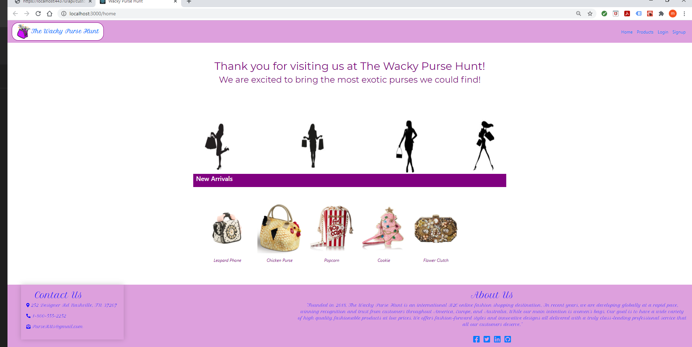
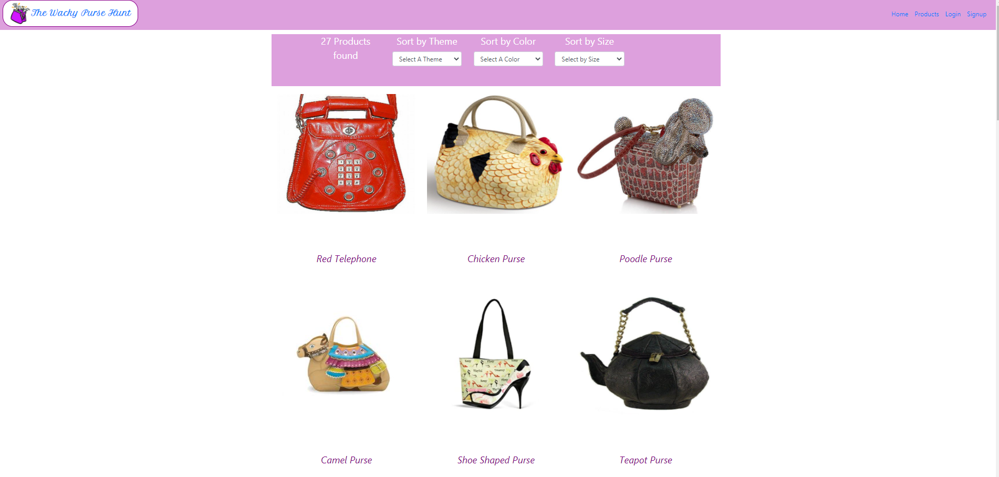
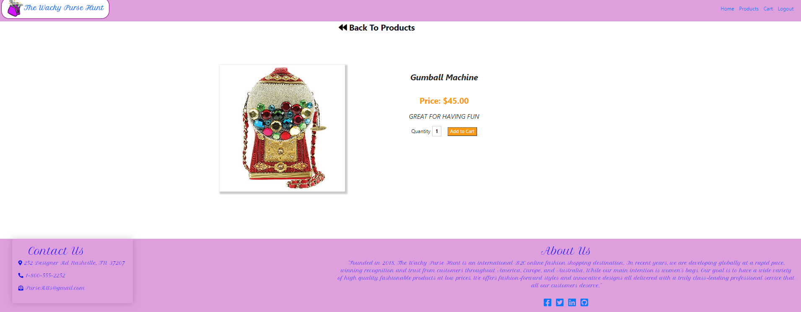
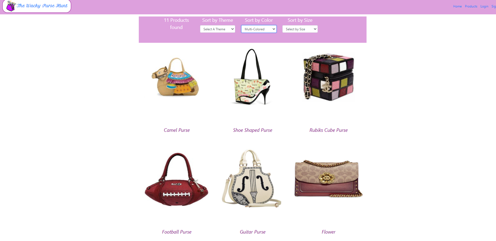
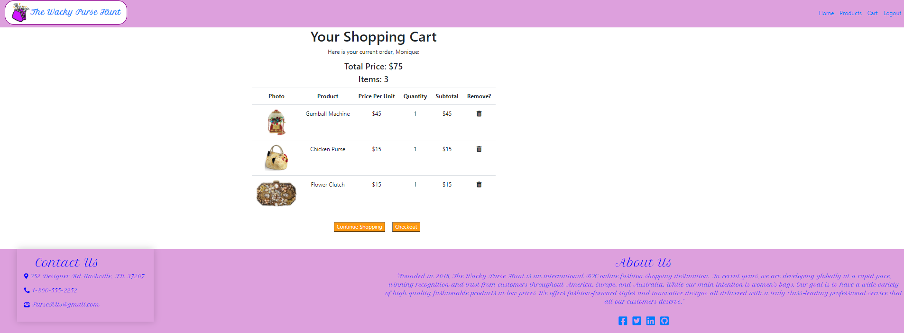

 ## WackyPurseHunt
## Description
This project showcases the use of firebase and json data with REACT Routing. We used firebase to store our data. We used axios promises to retrieve the data capturing the response.

### Feature List
- React
- Login
- SQL Database
- Products
- Shopping Cart

## Screenshots
### Home Page

### Products

### Product View

### Filter by Theme

### Filter by Color

### Filter by Size

### ShoppingCart View

## How to Run
1. Clone down this repo
1. Make sure you have http-server installed via npm. If not get it [HERE](https://www.npmjs.com/package/http-server).
1. Use the apiKeys.example.json to enter your API key information from firebase
1. On your command line run `hs -p 9999`
1. In your browser go to `http://localhost:9999`

## Contributors

[Monique Bass](https://github.com/Nikababy01)